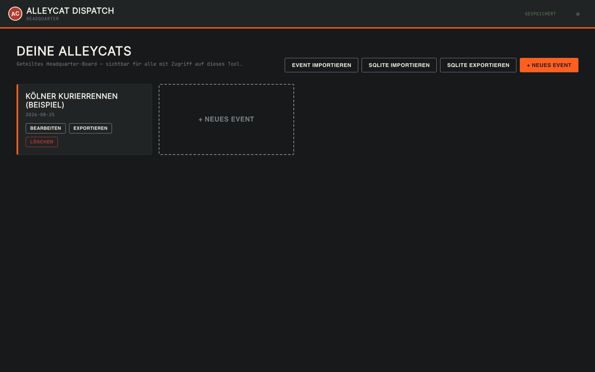
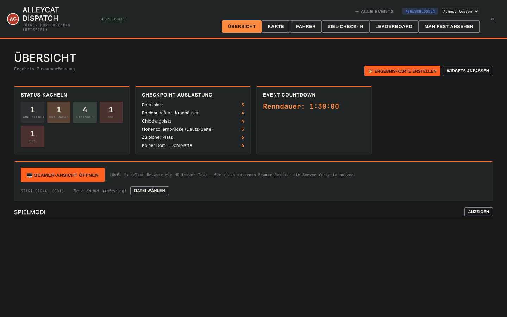
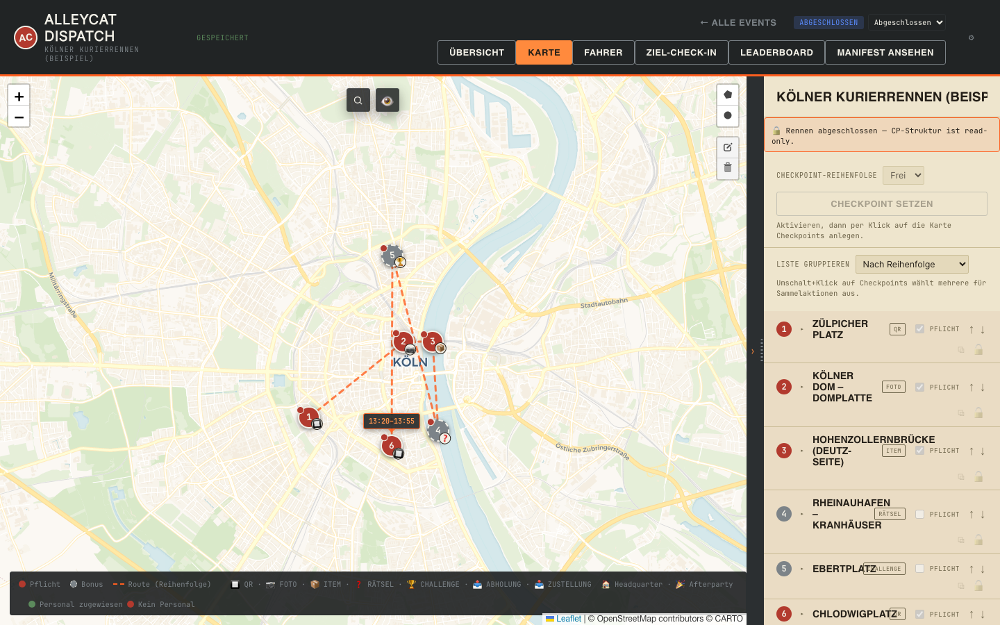
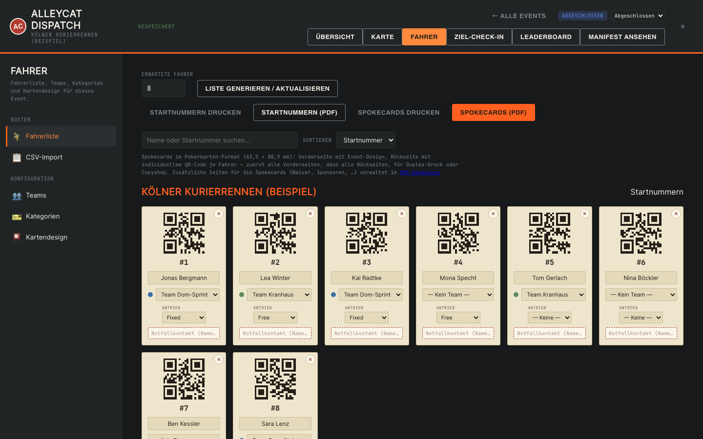
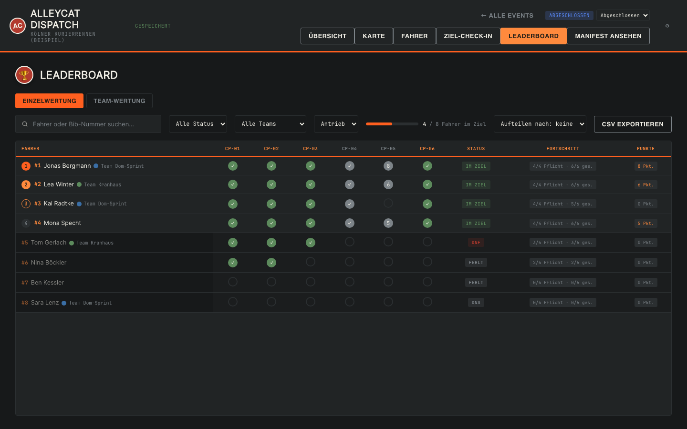

# Alleycat Dispatch

```
ALLEYCAT DISPATCH
Fahrrad-Checkpoint-Rennen organisieren, drucken, auswerten.
──────────────────────────────────────────────────────────
STATUS    Single-File-App · kein Server nötig
BUILD     node build.js  (0 Fremd-Dependencies)
STORAGE   lokal (SQLite/WASM) · oder Server (PHP/MySQL)
```


Organizer-Tool für Alleycats (Fahrrad-Checkpoint-Rennen): Events anlegen, Checkpoints auf der Karte platzieren, Startnummern & Spokecards drucken, Ziel-Check-in durchführen, Leaderboard führen und ein Manifest als PDF exportieren.

Quellcode ist modular (`src/`), Ausgabe bleibt weiterhin eine einzelne HTML-Datei pro Variante — ein kleines Node-Build-Skript ohne Fremd-Dependencies fügt beides zusammen.

## Screenshots

| | |
|---|---|
|  **Dashboard** — alle Events auf einen Blick, Import/Export als SQLite oder JSON |  **Event-Übersicht** — Status-Kacheln, Checkpoint-Auslastung, Countdown, Beamer-Zugang |
|  **Karten-Editor** — Checkpoints per Klick setzen, Typen (QR/Foto/Item/Rätsel/Challenge), Route mit Distanzen |  **Fahrerliste & Spokecards** — Startnummern, Teams, druckfertiger QR-Code-Export als PDF |
|  **Leaderboard** — Live-Fortschritt pro Checkpoint, Status (im Ziel/DNF/DNS), Punkte bei aktiven Spielmodi | |

## Schnellstart

1. `node build.js` ausführen — erzeugt `dist/alleycat-dispatch-local.html` und `dist/alleycat-dispatch-server.html`
2. `dist/alleycat-dispatch-local.html` direkt im Browser öffnen — läuft sofort, kein Server, kein `npm install` nötig
3. Fertig — Demo-Event ("Kölner Kurierrennen") ist beim ersten Start bereits angelegt

```bash
node build.js
```

## Zwei Varianten

Beide haben denselben Funktionsumfang, unterscheiden sich nur im Speicher-Backend:

| Datei | Wann nutzen | Speicherort |
|---|---|---|
| `dist/alleycat-dispatch-local.html` | Ein Organizer, ein Gerät | Lokale SQLite-Datenbank im Browser (sql.js/WASM, persistiert in IndexedDB) — inkl. `.sqlite`-Export/Import als Backup |
| `dist/alleycat-dispatch-server.html` | Mehrere Organizer/Geräte sollen dieselben Events sehen | Eigenes PHP/MySQL-Backend (siehe [`php-backend/`](php-backend/)) |

Beide Varianten prüfen zusätzlich zuerst, ob `window.storage` verfügbar ist (z. B. beim Betrieb in einer kompatiblen Artifact-Laufzeit) und nutzen das bevorzugt, falls vorhanden.

**Schnellstart Server:** bebilderte Anleitung in [`php-backend/INSTALL.md`](php-backend/INSTALL.md) — kurz zusammengefasst: `php-backend/` auf einen PHP+MySQL-Webspace hochladen, `install.php` einmal aufrufen, API-Endpunkt + Key kopieren und danach `install.php` löschen. Anschließend `dist/alleycat-dispatch-server.html` öffnen und die Zugangsdaten im Setup-Screen eintragen.

## Features

### Karte & Checkpoints
- Events mit beliebig vielen Checkpoints, Position per Karte (Leaflet) oder Koordinaten
- Checkpoint-Typen: QR-Code-Scan, Foto-Beweis, Item-Abgabe, Rätselfrage, Checkpoint-Wertung (Challenge, gepunktet) — plus eigene Checkpoint-Typen über die Einstellungen definierbar
- Checkpoint-Reihenfolge frei oder fest wählbar — bei fester Reihenfolge warnt der Ziel-Check-in bei Out-of-Order-Bestätigungen (mit protokolliertem Override) und zeigt Luftlinien-Distanzen zwischen den Checkpoints inkl. Gesamtdistanz
- Checkpoint-Liste mit Live-Auslastung, Zeitfenster-Status, manuellem Sperren/Duplizieren einzelner Checkpoints und Gruppierung nach Reihenfolge oder Typ; Checkpoint-Personal (Name/Telefon/Rolle/Schicht) mit eigenem, organizer-internem Personal-Briefing-PDF (nie auf Fahrer-Manifest/Spokecards)
- Karten-Editor: einklappbare Sidebar für mehr Kartenfläche, Hover-Synchronisation zwischen Checkpoint-Liste und Kartenmarkern, Shift-Klick-Mehrfachauswahl von Checkpoints mit Sammelaktionen (Typ zuweisen, als Pflicht markieren, sperren, löschen)

### Fahrer & Teams
- Fahrerliste mit Startnummern, Notfallkontakt-Feld (nicht auf gedruckten Startnummern/Spokecards sichtbar)
- Teams (Solo/Team-Zuordnung, Team-Wertung mit wählbarem Wertungsmodus: beste Einzelzeit oder alle müssen finishen) und frei definierbare Kategorie-Gruppen (Presets Antrieb/Gender oder eigene) pro Fahrer
- CSV-Bulk-Import für Fahrerlisten: Spalten-Zuordnung (Startnummer/Name/Team/Notfallkontakt), Validierung vor dem Import mit Fehlerliste statt stillem Scheitern, legt fehlende Teams automatisch an

### Rennablauf
- Renn-Zustandsmaschine (Planung → Bereit → Läuft → Abgeschlossen) mit CP-Struktur-Sperre während des Rennens und blockierendem Start-Dialog bei geplanter Startzeit
- Übersicht-Tab pro Event mit anpassbaren Widgets (Status-Kacheln, Checkpoint-Auslastung, letzte Aktivität, Kategorie-Verteilung, Mini-Leaderboard, Live-Countdown, nächste To-dos) — Sichtbarkeit und Reihenfolge frei einstellbar, pro Event gespeichert
- Ziel-Check-in-Flow mit Bestätigen/Zurücksetzen inkl. Undo, sowie DNF-/DNS-Markierung
- Leaderboard mit kombinierbaren Filtern (Status, Team, Kategorien) und Export als CSV (Excel-DE-kompatibel, semikolon-getrennt, optional aufgeteilt nach Team/Kategorie)
- Generisches Undo/Aktions-Log für die letzten Aktionen (z. B. Fahrer gelöscht, Kategorie geändert) — zusätzlich zum bestehenden Ziel-Check-in-Undo

### Spielmodi & Beamer
- Spielmodi-Engine: 7 vordefinierte, unabhängig kombinierbare Modi (Zeitfenster-CPs, Bonus-CPs mit Rang-Punkten, Geheime CPs mit Freischalt-Vorbedingung, Battle Royale mit schrumpfender Zone, Wildcard/Joker-Checkpoint pro Fahrer, Kettenreaktion-Bonus bei perfekter Reihenfolge, Sudden-Death-Ausscheiden bei Inaktivität) — Aktivieren eines punktevergebenden Modus schaltet das Leaderboard auf Punkte-Wertung um (Zeit bleibt als Zusatzinfo sichtbar), Punkte-Herkunft ist pro Fahrer einsehbar
- Beamer-Ansicht (eigene Route, zweiter Tab/Rechner): Countdown bis Startzeit mit Anzahl angemeldeter Fahrer, Vollbild-GO-Overlay mit Sound-Trigger beim Rennstart, danach Live-Leaderboard (Zeit seit Start, Platz, Name, Startnummer, Checkpoint-Fortschritt) — synchronisiert per BroadcastChannel + Storage-Polling; eigenständiges Sound-Hook-Modul (Datei-Upload pro Event, Test-Button)
- Live-Beamer für Spielmodi: sobald mindestens ein Modus aktiv ist, erweitert sich die Beamer-Ansicht automatisch um Punkte-Leaderboard, Live-Ticker der letzten Ereignisse (Bonus gesichert, Checkpoint enthüllt, Zone schrumpft, Fahrer ausgeschieden/im Ziel) mit Sound-Hooks je Ereignis, eine kleine Battle-Royale-Zonenkarte und ein Vollbild-Overlay bei Ausscheiden — bei keinem aktiven Modus verhält sich der Beamer unverändert wie ohne Spielmodi

### Export & Druck
- PDF-Baukasten: frei zusammenstellbare Zusatzseiten (Haftungsausschluss mit Unterschriftszeile, Renn-Regeln, Sponsoren-Logos, Checkpoint-Übersicht, Notizen, eigener Text, Notfall-Infos) wählbar pro Zieldokument (Manifest und/oder Spokecards), Reihenfolge frei sortierbar, als Vorlage exportier-/importierbar
- Manifest- sowie Startnummern-/Spokecards-PDF-Export, Manifest und Personal-Briefing öffnen dabei eine In-App-Vorschau statt direkt herunterzuladen
- Routen-Export als GPX
- Social-Share-Karten: automatisch generiertes Ergebnis-Bild (Top 3, Vereinslogo) nach Rennende zum Herunterladen oder direkten Teilen (Web Share API)

### Plattform & Komfort
- Datensicherheit & Offline: automatisches Backup-Download-Intervall während laufendem Rennen, Warnhinweis gegen versehentliches Schließen des Tabs, Wake Lock (Bildschirm bleibt an im Ziel-Check-in/Beamer), Speicherschätzung + Anfrage auf persistenten Speicher; Offline-Kartenkacheln-Cache pro Event (Bounding Box um die Checkpoints, herunterladbar in den Einstellungen) mit Warnhinweis bei veraltetem Cache
- 5 Themes (Feldpost, Hell, Dunkel, Dracula, Sonnenlicht — Hochkontrast-Modus für Einsatz im Freien) und 3 Icon-Packs (Emoji, Font Awesome, Material Symbols) über die Einstellungen
- Command Palette (Cmd/Ctrl+K) mit Fuzzy-Suche über Navigation, Fahrer, Checkpoints und Schnellaktionen; globale Zahlen-Tastenkürzel (1–6) zur Navigation und Esc zum Abbrechen aktiver Modi/Overlays
- Feature-Übersicht in den Einstellungen: alle schaltbaren Features (Social-Share-Karten, Sound-Effekte, Offline-Kartenkacheln, Kategorien, Spielmodi) an einer Stelle mit Suche, Toggle und Sprung zur jeweiligen Detail-Konfiguration
- Freundliche Platzhalter statt leerer Listen (Checkpoint-Liste, Fahrerliste, Leaderboard vor Rennstart, Übersicht "Letzte Aktivität") mit direkten Schnellaktionen
- Fehlerbildschirm statt weißem Bildschirm bei einem unerwarteten Programmfehler, mit Hinweis dass die Daten sicher gespeichert sind

## Weitere Dateien

- [`examples/koeln-alleycat-beispiel.json`](examples/koeln-alleycat-beispiel.json) — Beispiel-Event zum Reinschauen/Importieren
- [`examples/kölner_kurier-alleycat-manifest.pdf`](examples/kölner_kurier-alleycat-manifest.pdf) — Beispiel-Export eines Manifests
- [`test-suite.js`](test-suite.js) — End-to-End-Testsuite; Inhalt in die Browser-Konsole eines laufenden `dist/`-Builds einfügen und `runAlleycatTestSuite()` aufrufen. Läuft unverändert gegen beide Varianten.
- [`docs/`](docs/) — Roadmap ([`docs/alleycat-dispatch-roadmap-14-23.md`](docs/alleycat-dispatch-roadmap-14-23.md)) sowie Spezifikations- und Archiv-Dokumente aus der Projektplanung.

## Entwicklung

Quellcode liegt in `src/` (siehe [`CLAUDE.md`](CLAUDE.md) für die Modul-Übersicht), `dist/` ist reiner, nicht versionierter Build-Output — **niemals direkt in `dist/*.html` editieren**, das wird beim nächsten `node build.js` überschrieben.

Alles in `src/core/` muss zwischen beiden Varianten byte-identisch bauen; Backend-spezifisches Verhalten gehört in `src/storage/storage-local.js` bzw. `storage-server.js`, angebunden über die beiden Storage-Seams `initStorageBackend()` und `renderStorageDashboardExtras()` (Details in `CLAUDE.md`). Nach jeder Änderung: `node build.js`, dann `diff dist/alleycat-dispatch-local.html dist/alleycat-dispatch-server.html` — sollte weiterhin nur in den bekannten Storage-Regionen abweichen.

## Roadmap

13 von 14 geplanten Arbeitspaketen sind abgeschlossen (Details: [`docs/alleycat-dispatch-roadmap-14-23.md`](docs/alleycat-dispatch-roadmap-14-23.md)). Offen:

- **PHP-Backend auf echtem Hosting testen** — bisher nur gegen lokale MariaDB verifiziert, noch nicht auf realem Shared-Hosting installiert
- **Fahrer-Selbstregistrierung** — öffentlicher Anmeldelink statt nur organizer-generierter Startnummern-Slots
- **Live-Multi-Checkpoint-Check-in / Live-Zuschauer-Leaderboard** — nur über `alleycat-dispatch-server.html` möglich, blockiert aktuell noch am fehlenden Concurrency-Schutz im Storage-Protokoll (last writer wins)

Bewusst zurückgestellt: Offline-Gerätesync per Screen-to-Camera-QR (nur Idee, kein aktives Paket).
