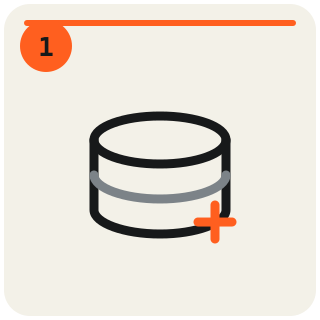
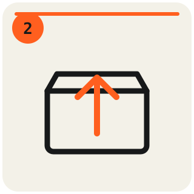
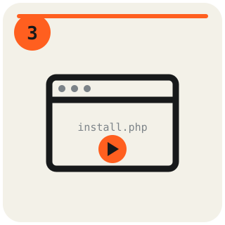
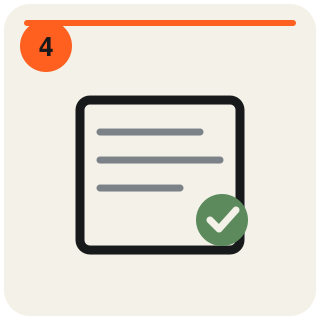
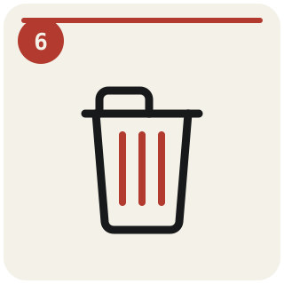
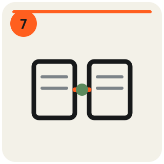

# Installguide: PHP-Backend einrichten

Schritt-für-Schritt-Anleitung, um die Server-Variante der App mit einem eigenen PHP/MySQL-Backend zu verbinden — für den Einsatz mit mehreren Organizern/Geräten auf demselben Event. Dauert je nach Hosting-Anbieter ca. 5–10 Minuten.

**Mindestanforderungen:** PHP ≥ 7.4, MySQL ≥ 5.7 oder MariaDB ≥ 10.2, PHP-Extension `pdo_mysql`, Schreibrechte im Zielverzeichnis — jedes normale Shared-Hosting-Paket reicht, kein WordPress nötig. `install.php` prüft das beim Aufruf automatisch (siehe Schritt 3) und warnt, falls etwas fehlt.

**Fällt der Umgebungscheck in Schritt 3 rot aus und lässt sich der Hoster nicht wechseln:** die **lokale Variante** nutzen (`dist/alleycat-dispatch-local.html`, läuft komplett im Browser als SQLite-Datenbank, keine Server-Voraussetzungen) — dafür braucht es nichts von diesem Guide hier.

---

###  Schritt 1 — Datenbank + Benutzer anlegen

Im Control-Panel deines Hosting-Anbieters (Plesk, cPanel, IONOS, …) eine **MySQL-Datenbank** und einen **Datenbank-Benutzer** mit Zugriff darauf anlegen — falls nicht ohnehin schon vorhanden. Host, Datenbankname, Benutzername und Passwort notieren, die brauchst du gleich in Schritt 4.

---

###  Schritt 2 — Ordner hochladen

Den kompletten [`php-backend`](.)-Ordner (alle `.php`-Dateien, `.htaccess`, diese Anleitung) per FTP oder dem Dateimanager deines Hosting-Panels auf den Server hochladen — z. B. nach `/php-backend/` innerhalb deines Webspace. Die Reihenfolge der Dateien spielt keine Rolle, nur `install.php` muss zuerst aufgerufen werden (Schritt 3).

---

###  Schritt 3 — Installer aufrufen

`install.php` im Browser öffnen, z. B.:

```
https://deinedomain.tld/php-backend/install.php
```

Zeigt zuerst einen automatischen **Umgebungscheck** (PHP-Version, benötigte Erweiterung, Schreibrechte, `utf8mb4`-Verfügbarkeit u. a.) — bei ✅/⚠️ direkt weiter zu Schritt 4, bei ❌ entweder das gemeldete Problem beheben oder bewusst per Checkbox "Trotzdem installieren" übergehen.

---

###  Schritt 4 — Formular ausfüllen

Die Zugangsdaten aus Schritt 1 eintragen:

| Feld | Typischer Wert |
|---|---|
| Datenbank-Host | meist `localhost` |
| Datenbank-Name | aus Schritt 1 |
| Datenbank-Benutzer | aus Schritt 1 |
| Datenbank-Passwort | aus Schritt 1 |
| Tabellen-Prefix | optional, Standard `alleycat_` |

Absenden — der Installer legt die Tabelle an und generiert einen zufälligen API-Key.

---

###  Schritt 5 — API-Endpunkt + Key kopieren

Auf der Erfolgsseite stehen **API-Endpunkt** und **API-Key** — beide jetzt kopieren, der Key wird danach nicht erneut angezeigt (in `config.php` landet nur ein Hash davon, nicht der Key selbst). Beispiel-Endpunkt:

```
https://deinedomain.tld/php-backend/api.php
```

---

###  Schritt 6 — install.php löschen

`install.php` versucht sich nach erfolgreicher Installation **selbst zu löschen** — meist ist hier also nichts mehr zu tun. Zeigt die Erfolgsseite stattdessen einen Warnhinweis ("konnte sich nicht selbst löschen"), fehlten die nötigen Schreibrechte — dann `install.php` jetzt manuell per FTP/Dateimanager entfernen, er sollte nicht öffentlich erreichbar bleiben. `config.php` und die übrigen Dateien (`api.php`, `backup.php`, `migrate.php` etc.) bleiben auf dem Server — `config.php` ist bereits über `.htaccess` vor direktem Web-Zugriff geschützt.

---

###  Schritt 7 — Mit der App verbinden

Im Repo `node build.js` ausführen und `dist/alleycat-dispatch-server.html` öffnen — beim ersten Start erscheint ein Setup-Screen. Dort API-Endpunkt und API-Key aus Schritt 5 eintragen und auf **Verbinden** klicken. Die Zugangsdaten werden danach lokal im Browser gemerkt (nur der Zugang, nicht die Event-Daten selbst).

Zum späteren Zurücksetzen (z. B. anderes Backend eintragen): die Seite mit `?reset-php-config` an der URL aufrufen. **Danach den Parameter aus der Adresszeile entfernen**, bevor du das Setup abschickst — er wird beim Neuladen mitgenommen und würde die gerade gespeicherten Zugangsdaten sofort wieder löschen.

---

### Schritt 8 — Fahrer-App hochladen (optional)

Nur nötig, wenn Fahrer an Checkpoints per QR-Code selbst einchecken sollen. Ohne diesen Schritt funktioniert alles andere unverändert; alle zugehörigen Funktionen bleiben in der Organizer-App einfach ausgeblendet.

1. `node build.js` erzeugt neben den beiden Organizer-Varianten auch **`dist/alleycat-rider.html`**. Diese eine Datei irgendwohin unter deine Domain hochladen — ein bestimmtes Verzeichnis ist nicht nötig, die App kennt `rider.php` aus der Konfiguration.
2. Im Setup-Screen der Server-Variante die **Fahrer-App-Adresse** eintragen (drittes Feld, z. B. `https://deinedomain.tld/alleycat-rider.html`). Auf diese Adresse zeigen die QR-Codes auf Spokecards und Checkpoint-Aufstellern.
3. Im Checkpoint-Editor bei den Checkpoints das Häkchen **QR Check-In** setzen, an denen Fahrer selbst einchecken sollen.
4. Unter *Manifest → Drucken* die **Checkpoint-QR-Blätter** erzeugen, ausdrucken und laminieren. Die Spokecards tragen ab dann automatisch den Fahrer-Link statt der nackten Startnummer.

**Zwei Dinge, die der Hoster können sollte:**

- **HTTPS** — dringend empfohlen. Die Fahrer-App trägt Zugangs-Token in Anfragen; über unverschlüsseltes HTTP liest die das offene WLAN am Start mit. Kein technischer Zwang, aber der Unterschied ist real.
- **Kompression** (Apache `mod_deflate`, nginx `gzip on`) — bei Standard-Hosting üblich. Die Fahrer-App ist 331 KB groß, komprimiert aber nur 82 KB. Ohne Kompression lädt jedes Handy die vierfache Menge, und zwar dort, wo der Empfang am schlechtesten ist. Prüfen lässt sich das mit `curl -sI -H "Accept-Encoding: gzip" https://deinedomain.tld/alleycat-rider.html | grep -i content-encoding`.

**Was heute noch nicht geht:** Die Fahrer-App muss einmal mit Verbindung geladen werden. Check-ins *ohne* Empfang funktionieren (sie werden gepuffert und automatisch nachgesendet), aber ein Neuladen der Seite im Funkloch zeigt die Fehlerseite des Browsers. Sag den Fahrern in der Startbesprechung, sie sollen die App vor dem Start öffnen und offen lassen.

---

## Fertig

Ab jetzt teilen sich alle Geräte, die die Server-Variante mit denselben Zugangsdaten öffnen, dieselben Events — Organizer und Marshals sehen denselben Stand.

Bei Problemen: siehe [README.md](README.md) für die Datei-Übersicht und was `api.php`/`config.php` genau tun, sowie [COMPATIBILITY.md](COMPATIBILITY.md) für bereits erprobte Hosting-Umgebungen und bekannte Grenzen.
